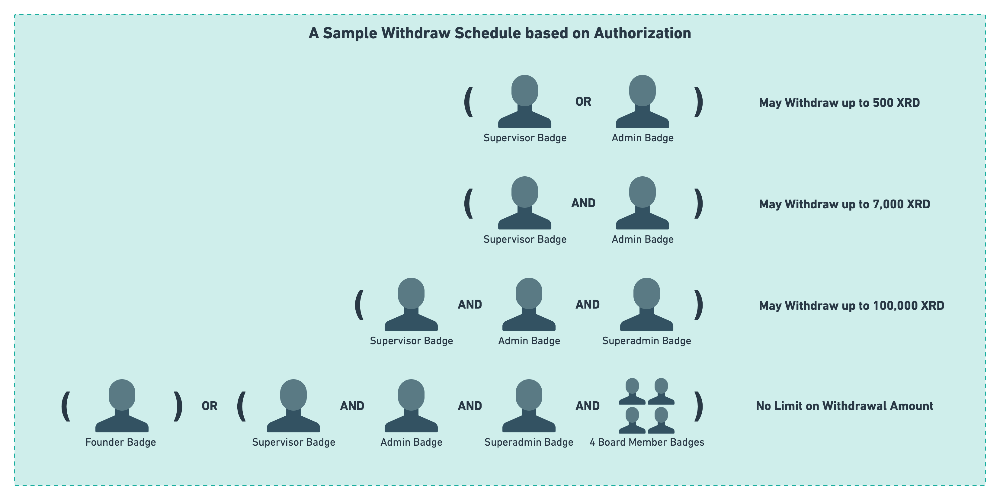

# Limited Withdraw Vault

## Motivation

Come Babylon, there will be a need for people to share pools of liquidity but not through percentage shares, through a fixed predefined amount. As an example, there will be a need for a company to share funds such that people at different level of the organizational structure can withdraw funds in accordance to their level in the company. Or, there will be a need for two friends to share a storage of funds where they both define how much the other can withdraw. 

General components which store funds and only allow the withdrawal of certain authorized amounts to certain authorized entities are essential for the ecosystem of DeFI lego built on Radix. This blueprint makes no assumptions about the context in which it will be used and provides developers with multiple ways of configuring this blueprint's authorization to suit their needs however simple or complex those needs may be.



The functionality that this blueprint defines can be summed up by the diagram shown above. This component stores funds and then allows authorized entities to withdraw amounts which have been authorized to them by the component's instantiator. The entities which we talk about in the context of the blueprint can be as simple as a single badge or as complex as an organizational structure which allows for the withdrawal of tokens. 

This blueprint is structure agnostic meaning that it does not make any assumptions about the context in which it will be used. Not much aside from the main logic is hard-coded. Everything else-in terms of authorization and access rules-are user-defined which allows for a great deal of customization of components instantiated from the blueprint.

## Design Considerations

### Individual Limit Proofs

One of the decisions made when developing this blueprint is the choice to avoid the use of individual withdraw limit badges, as in, non-fungible badges which would be used to denote withdraw limits and can have metadata relating to how much has been withdrawn so far and what their withdraw limit is. 

While such an idea might seem like a neat solution to what is being developed here, it is simply too limiting. The limitation in this approach comes from the assumption that withdraw limits will have one-to-one mapping to authorized entities. However, this is not true as seen by the withdraw schedule diagram shown in this document. There is a need to have the ability for multiple authorized entities to be involved in the withdraw of authorized funds such is the case for the case of the 7,000 XRD withdrawal which requires both the supervisor and admin badges.


So, consider the case where we wish to say that a supervisor badge and an admin badge are need to be present to authorize the withdraw of 7,000 XRD. Had individual proofs been used here, who would get the proof? The supervisor, the admin, or both? Similarly, consider the case where three entities are now involved to authorize the withdraw of 100,000 XRD. Which of these three entities should get the badge associated with this withdraw level? Some of the entities or all of them? 

If your answers to the previous questions were "all entities should have the required badges" then you are already on the right track in terms of thinking and reasoning about this problem. If some or one of the entities supposed to authorize the withdraw get the needed badges then the other entities which did not are essentially left out of the decision to withdraw funds which is quite obvious. This necessitates that all entities involved in a withdraw authorization get badges. 

Now, think about this as a general blueprint which is meant to be agnostic of any organizational or authorization structure. The blueprint needs to fit the needs of as many developers as possible with little to no modifications made to it. Would it make sense in this context for the blueprint to create its own badges and distribute them out to people? What if the instantiator of the blueprint wishes to provide their supervisor with a badge that they control the burning for? or a recallable badge? What if the instantiator wishes to use an NFT for their own internal purposes? Clearly there is a need that the blueprint either: a) allows for the creation of badges of arbitrary complexity and covering all use cases which might exist, b) allow the instantiator or the entity in charge of the component to create it's own badges with it's own rules and then effortlessly hook them up to the component.

Looking at choices _a_ and _b_, it is clear that the former is far more complex than the latter if it will be implemented in a composable way which fits into the DeFI lego way of thinking. Allowing the instantiator to create their badges in the way that they see fit and the hooking them up to our component seems like a clear winner in this case.

Keep in mind, individual limit badges would only allow for "and" logical rules to exist between the different entities in the withdraw rule instead of any "or" logical operations. Due to this and other reasons described above, this blueprint does not provide the authorized entities with badges (unless they explicitly ask for it). Instead, this blueprint combines application-level and system-level auth in a unique and powerful way which allows for it to exist. The instantiator of the component can add an `AccessRule` as well as a `WithdrawLimit` to the component. Then, all calls to the `withdraw` method with `Proof`s that fulfill this access rule would be allowed to withdraw funds within the specified `WithdrawLimit` associated with the satisfied access rule.

Without the combination of application-level and system-level auth, a secure implementation feature-complete implementation of this concept would've been difficult to implement if not outright impossible. In this application, the system-level aspect to auth allows for the system to perform the checking of auth-rules which would've otherwise been a difficult feat to implement on the Scrypto side. In addition, the radix engine understands how to group and compose proofs to check for max proof which means that the already existing radix-engine-side implementation is inherently more secure. 

### Composable, Structure Agnostic Blueprint

The process and line of thinking which went into the choices made for the authorization in this blueprint can be summed up by the following questions and their answers:

* Should the blueprint create a new badge and give it admin access? 

    This is way too limiting! What if the instantiator wishes that admin power is distributed among a number of people and not a single admin-badge-holder?

* Should we allow for the creation of as many admin badges as needed?

    Again, this is too limiting and quickly opens the door up for abuse. Who should have the right to mint more admin badges? should it be a dynamic rule? should it take the majority of admins to mint a new admin badge? This simply opens the door up for too many questions.

* Say we allow for the minting of multiple admin badges, what about people needing to get this blueprint to work with their desired complex authorization structure? 

* What if we do not any create badges, instead, we allow the instantiator create their own badges and pass an `AccessRule` when instantiating the component?

    We are finally beginning to converge on a solution. Clearly, the creation of an admin badge by the blueprint makes too many assumptions about the way in which the blueprint will be used and raises too many questions. While the creation of an admin badge and hard-wiring of access rules might be fine for some users with simple needs, it simply would not work for users with more complex needs.

    While this solution is nice, and is a good first step at trying to solve this problem, it still has a problem: what if we would there not to be a single concept of an admin. Instead, what if we'd like to allow supervisors to be able to add authorized withdraw entities, while admin badges only be able to remove authorized withdraw entities and add more entities. As in, what if wish for the concept of an administrator not to exist. Instead, what if we would like for this concept to be split up across multiple different entities which are user-defined?

* What if we let the instantiator pass in `AccessRules` (not a singular `AccessRule`) which defines the authorization of the entire component?

    This is it! This is as flexible as the original idea behind the blueprint is! Again, the instantiator has the power of setting up component authorization in whoever way they see fit and with as much flexibility as they would like.

Therefore, this blueprint defines three different functions from which limited withdraw vaults may be created. These three instantiation functions are aimed at three distinct groups of developers who might use this blueprint: layperson, intermediate, expert. A detailed explanation of the three instantiation functions is as follows:

| Function                                          | Target Developers | Description     |
| ------------------------------------------------- | ----------------- | --------------- | 
| `instantiate_simple_limited_withdraw_vault`       | Layperson         | This is a simple instantiation function which is meant to create for the caller everything which they may need to get a component up and running. Therefore, this function creates a new admin badge, configures the access rules on the component to allow it to perform administrative operations, and returns it back to the caller. This function depends on the `instantiate_custom_limited_withdraw_vault` function for what it does.
| `instantiate_custom_limited_withdraw_vault`       | Intermediate      | This function is more customizable and allows for limited withdraw vaults to be created whose administrative `AccessRule` is user-defined. The administrative is the rule which governs who can add authorized withdraw entities, remove them, and update their limits. This function depends on the `instantiate_bare_bone_limited_withdraw_vault` function for what it does.
| `instantiate_bare_bone_limited_withdraw_vault`    | Expert            | This function instantiates a "bare bone" limited withdraw vault, meaning that this function creates the minimum amount of resources and components which need to be created in order to get a minimal limited withdraw vault to work (in this case, it creates additional components or resources). This function takes in an `AccessRules` object and uses it as the rules which the component will adhere to for its methods. While this function provides a great deal of flexibility to developers, it is also very error-prone defining incorrect rules could potentially lead to this component getting locked. So, while this function is available to use and is publicly visible, it is recommended that--unless you know very well what you are doing--you use the `instantiate_custom_limited_withdraw_vault` function to instantiate your component.

| Note | The "expert" functions are not named as such to be a competition to developers, this is a name given to them because they require a good understanding of how access rules work in Scrypto and a very good understanding of how the blueprint works in order to use. Misconfiguring the component authorization when using the "expert" functions will most certainly result in great loss.
| -----| :------ |

An interesting advantage which comes as a result of the general structure agnostic design of this blueprint, is that developers can use components of this blueprint as a multi-signature (multi-sig for short) store or vault. Meaning, you can skip the whole badge creation and distribution process, and you can use your account's virtual badges if you want! 

## Example of Usage

First of all, please run the `build_rtm.sh` file to build the transaction manifest files which will be used for this example. This script will ensure that the manfiest files contain a valid set of addresses for your machine. To run this bash script, run the following command:

```sh
./build_rtm.sh
```

To demonstrate how this blueprint can be used, we will add a number of withdraw authoroties to one of its components. The withdraw authoroties will have the following access rules and withdraw limits asociated with them: 

| `AccessRule`                                 | Withdraw Limit |
| -------------------------------------------- | -------------- |
| `20 Employees && 10 Managers && 1 Executive` | 100 XRD        |
| `20 Employees && 12 Managers && 1 Executive` | 500 XRD        |
| `20 Employees && 15 Managers && 1 Executive` | 1,000 XRD      |
| `20 Employees && 20 Managers && 1 Executive` | No Limit       |

### Setup

First thing we need is to reset resim in order to ensure that the addresses which come up will be in line with those created by the `build_rtm.sh` script. 

```sh
resim reset
```

We then to create a new account to use in resim to test this blueprint

```sh
OP1=$(resim new-account)
export privkey1=$(echo "$OP1" | sed -nr "s/Private key: ([[:alnum:]_]+)/\1/p")
export account1=$(echo "$OP1" | sed -nr "s/Account component address: ([[:alnum:]_]+)/\1/p")
```

The examples here will be using a "custom" limited withdraw vault, meaning that we are expected to provide the blueprint with which badges we wish to use for authorization. Thus, we need to create a number of badges to use for testing. 

```sh
export admin_badge1=$(resim new-token-fixed 1 | sed -nr "s/.*Resource: ([[:alnum:]_]+)/\1/p" | sed '1!d')
export admin_badge2=$(resim new-token-fixed 1 | sed -nr "s/.*Resource: ([[:alnum:]_]+)/\1/p" | sed '1!d')

export employee_badge=$(resim new-token-fixed 20 | sed -nr "s/.*Resource: ([[:alnum:]_]+)/\1/p" | sed '1!d')
export manager_badge=$(resim new-token-fixed 20 | sed -nr "s/.*Resource: ([[:alnum:]_]+)/\1/p" | sed '1!d')
export executive_badge=$(resim new-token-fixed 1 | sed -nr "s/.*Resource: ([[:alnum:]_]+)/\1/p" | sed '1!d')
```

With the creation of test badges out of the way, we can now finally publish our package to resim and begin using it!

```sh
export package=$(resim publish . | sed -nr "s/Success! New Package: ([[:alnum:]_]+)/\1/p")
```

### Working with Component

With the package published to resim, we may now create a new limited withdraw vault component. In this example, we do not wish to create a simple component which uses a single admin badge for the administrative rights. Instead, we wish to create a more complex component which uses more complex authorization rules for administrative methods. Therefore, the component we're creating will have an administrative rule of: `admin_badge1 && admin_badge2`.

Since we wish to create a limited vault component whose administrative rights are complex rules defined by us, we will use the `instantiate_custom_limited_withdraw_vault` instantiation function to allow us to set those rules. The administrative rule of the component that we're creating is rather simple; for a call to an administrative method to go through, both `admin1` and `admin2` badges need to be present. In code, this is quite easy to represent. You can also represent it as an `AccessRule` enum in transaction manifests but its a little bit more difficult. To create the component, you can run the `component_creation.rtm` transaction manifest file by running:

```sh
resim run ./transactions/component_creation.rtm
```

We now have a limited withdraw component which is ready for us to use. We now need to fund this component to be able to use it for testing. We can do that by calling the `deposit` method on the component. The call to this method is quite simple so we can perform it through resim's transaction builder instead of using the transaction manifest:

```sh
resim call-method $component deposit 1000000,030000000000000000000000000000000000000000000000000004
```

We now have a component created and funded and we are finally ready to make use of it! We would now like to add the withdraw authorities which we mentioned in the above table. In general, the addition of new withdraw authorities is done through the `add_withdraw_authority` method which takes in an `AccessRule` and `WithdrawLimit` and creates an internal mapping for them. Then, when a caller presents a vector of proofs which satisfies one of the `AccessRule`s in the mapping, the withdraw limit of the caller is set to the corresponding `WithdrawLimit` from the mapping. 

The transaction manifest file `adding_withdraw_authorities.rtm` contains the instructions needed to call the `add_withdraw_authority` method on the component four times to add the four authorized withdraw entities that we wish to add. You can run it by: 

```sh
resim run ./transactions/adding_withdraw_authorities.rtm
```

We now have the withdraw authorities added to our component. We can now try to withdraw funds from the component to test how well it works. We will act as the first case: `20 Employees && 10 Managers && 1 Executive` and attempt to withdraw 100 XRD. 

```sh
resim run ./transactions/withdraw_within_limit.rtm
```

To ensure that the component works as expected, we can try removing one of the authorized withdraw entities from the component to see if the component would still allow for withdrawals of its kind to go through or not. We would like to remove the withdraw entity which has an infinite withdraw power. Then, we want to try to withdraw funds as this entity to see if the component will reject our withdraw or not. The expected and correct behavior is that the component would reject the withdraw

```sh
resim run transactions/remove_withdraw_auth.rtm
resim run transactions/withdraw_after_authorization_removal.rtm 
```

## Notes:

* This blueprint has not had it's efficiency with gas tested in any capacity and might very well be gas-inefficient. This is something which you must keep in mind before replicating similar behavior into your blueprint.