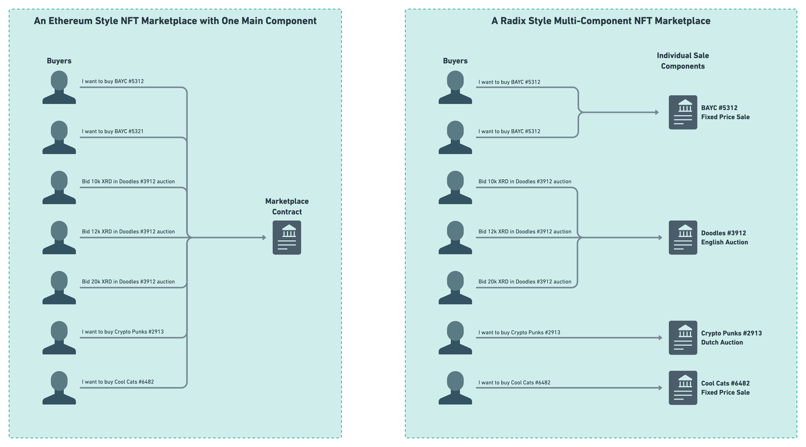

# NFT Marketplace

This package includes a number of blueprints that implement functionality typically seen in NFT marketplaces such as [OpenSea](https://opensea.io/), [Rarible](https://rarible.com/), and so on. The blueprints implement multiple types of sales such as: a fixed price sale, Dutch auction, and English auction. The aim of this package is to showcase to developers how functionality similar to that seen in popular NFT marketplaces can be implemented with Scrypto on Radix.

## Package Features:

* Supports multiple types of sales.
* Allows NFT sales to take place through any token the seller specifies (does not have to be XRD).
* NFTs can be sold individually or as a bundle if the seller wants to sell them all together.
* No central contract/component which makes this more efficient and scalable.

## Design Considerations

This package is designed in a way that showcases the power of Radix's concept of components and their importance for the scalability of the network and how monolithic application from other blockchains can be made into multiple smaller components and blueprints in Radix. 

Consider the Ethereum-style NFT marketplace shown in the diagram above, most NFT marketplaces in other blockchains and ledgers have a central contract which all sellers and buyers need to talk to in order to perform the action that they wish to make. This approach to building a marketplace has a many problems and issues associated with it:

1. From a scalability point of view, this is terrible as it means that there is one contract which all interactions with the marketplace go through, thus, it's very easy to see that this single contract becomes a bottleneck rather quickly as the marketplace would only be able to process a single purchase at one.

1. In most cases, this quickly becomes a monolithic contract which implements all types of sales, handles multiple types of sales, and handles millions of dollars of funds all in a single contract. Monolithic contracts are more prone to bugs as they're harder to develop, harder to reason about, and capturing all of the edge cases of a monolithic system is difficult so writing unit tests for the edge cases will be far from easy. Due to the aforementioned reasons, adding features to a monolithic contract is is not easy which explains why a lot of NFT marketplaces do not support multi-token sales or NFT bundles. 

Once code gets very big, it becomes no different from a large ship. Its difficult to steer and to change it course, and the smallest of mistakes could lead to the largest of catastrophes. 

Therefore, there does exist a need for NFT marketplaces to be re-imagined and built in a different way which removes the old monolithic style to handling marketplaces, and introduces a new style to how such applications can be built, maintained, and used. 

The system implemented in this package is very different from what you might expect to see in other blockchains. Due to the reasons listed above, this NFT marketplace does not have a single blueprint or component which defines the marketplace. Instead, this package comes with multiple modular blueprints which represent the types of sales that are possible to perform in the marketplace. When a seller wishes to sell their NFTs, they can simply instantiate a new component from the blueprint representing the type of sale they wish to have, and this would be it!

This means, the marketplace exists as a collection of components belonging to a collection of blueprints which all exist on the ledger with no on-ledger component linking them. To realize the advantage of this approach, consider the two diagrams shown above which showcase how an NFT marketplace can be implemented on Ethereum and on Radix. As has been mentioned before, the Ethereum style marketplace has all of the buyers calling a single contract which does not make sense from a scalability point of view. On the other hand, the Radix approach is to allow for multiple components to exist on ledger for the multiple sales that are going on at any one time. Buyers only call the component which holds the NFTs that they're interested in instead of calling a global contract which then routes or performs the sale itself. This approach makes even more sense when you consider how the network will work when Xi'an comes where component will live in a shard, if there existed a single component which all sales had to be piped through, then this would create bottlenecks as there would exist one shard which all sales rely on and need to queue for, which creates slowdowns in sales. However, this approach removes the bottleneck and allows for parallel sales as each sale would practically happen in its own shard irrelevant of any information from other shards (not including the one which the account lives in)

Despite that, there does exist a need for something to "link" all of these components together. At the end of the day, how else do the plan on showing them on a website or user interface when there is nothing to link all of them together? This need does indeed exist, however, this burden can be offloaded to off-chain solutions which would handle the aggregation of newly created components and create a database of currently active sales, thus, reducing the stress on the on-chain components.

## Demonstration

### Fixed Price Sales

As the name suggests, a fixed price sale is a sale which happens at a fixed price determined by the seller. The price of the NFT(s) does not change throughout the period of the sale unless the seller explicitly orders the price to be changed. When making the sale, the seller is free to choose which token they wish to sell their NFTs for. As an example, they can choose to sell them for 100 XRD, 100 CERB, or perhaps 100 USDT, all of this is in the hands of the seller to choose when they're creating a new fixed price sale. 

Lets go through the process of how a fixed price sale can be setup by the seller and what the buyer needs to do in order to purchase the tokens. First of all, the `bootstrap.rs` module contains a blueprint which creates a number of test NFTs for us which we will need to use for the purposes of testing. So, right after creating the accounts, publishing the package, etc... we will need to call a specific function on this blueprint to get it to create some NFTs for us.

### Dutch Auction

The idea behind Dutch auctions is simple: you list your NFTs for a given starting price, the price of your NFTs decreases until it reaches a specified minimum at a specified epoch. This process gives a change to interested buyers to buy your NFT(s) at the price that they believe to be reasonable for what you are selling. 

As an example, say I wish to sell an NFT in a Dutch auction, the following are the details of the dutch auction we wish to hold:

| | | 
| ---- | ----- |
| Starting Price | 1,000 XRD | 
| Minimum Price | 500 XRD |  
| Period | 50 Epochs |  

Looking at the above table of details, this Dutch auction will begin at 1,000 XRD and then over a period of 50 epochs, the price will drop to a minimum of 500 XRD, meaning that the price would drop by 10 XRD per epoch. Thus, if a buyer decides to buy this NFT 25 epochs after the beginning of the auction, then they would buy it for 750 XRD.

### English Auction

The English Auction is a very interesting type of sale and is typically the type of auction that comes to mind when you hear the word "auction". English auctions are simple: a seller puts NFTs up for sale, bidders bid according to how much they're willing to pay for the NFTs, then at the end of the auction's period, the bidder with the highest bid wins the auction. Quite straightforward.

## Shortcomings

* This package does not implement royalties on token sales. However, such functionality would not be difficult to add as it would be comprised of some metadata and a way to store the funds.